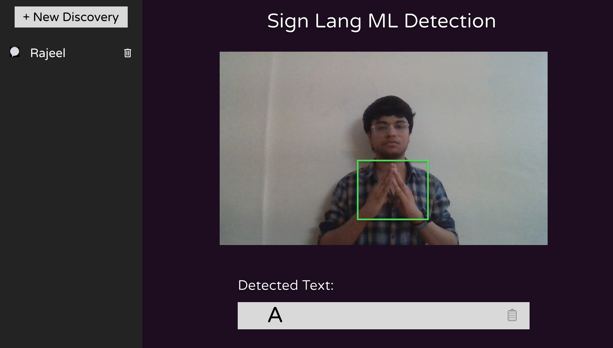
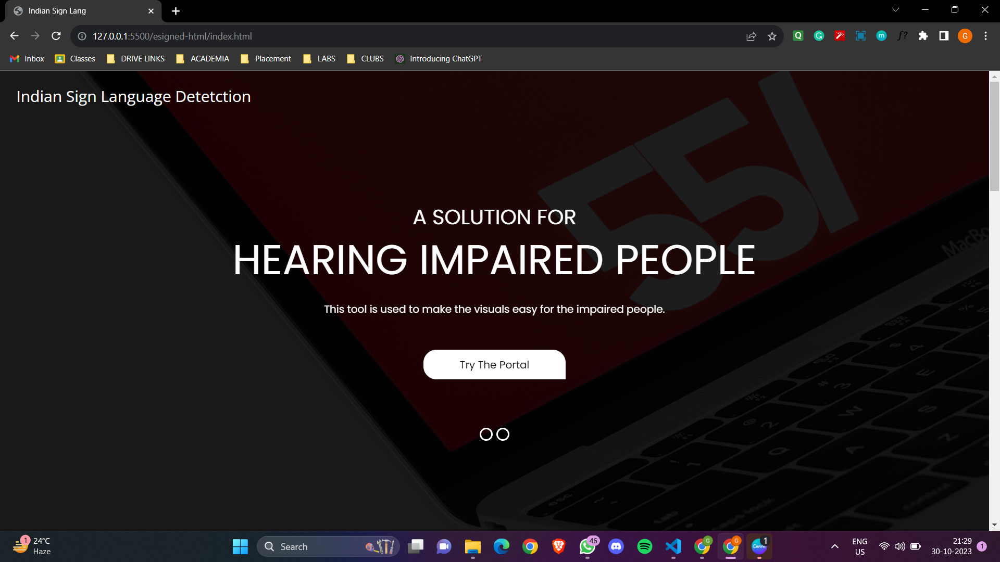
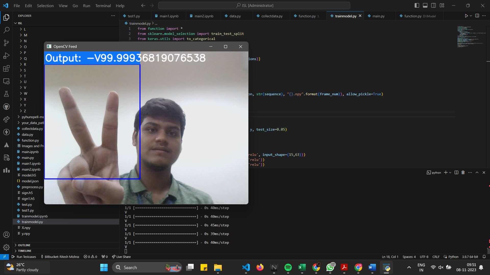

# Indian-Sign-Language-Machine-Learning-Group-Project

Indian Sign Language is a Machine Learning Project developed by:-

Tarush Chintala (RA2111027010004),
Gaurang Ashava (RA2111027010007),
Ritesh Mishra (RA2111027010014)
 

The dataset used in this project is supported by Kaggle 
The link for the dataset is given below - <href> https://www.kaggle.com/datasets/vaishnaviasonawane/indian-sign-language-dataset </href>

The landing page in the project is been made using HTML CSS and basic fundamentals of JS.

In this model, live feed will be captured dynamically within micro-seconds and the output will be given in the .png format which will combine together and form a video.
 
This is the model which we have designed
 

 
 
This is the landing page of our model 
 

 
 
This is the final output generated by the model
 

 
 
Below is the Project Report and PPT (link)
 
 
<a href="INDIAN SIGN LANGUAGE DETECTION PROJECT REPORT.pdf">Project Report</a>
 
 
<a href="INDIAN SIGN LANGUAGE DETECTION PPT.pptx">PPT</a>
 
 
<a href="https://www.canva.com/design/DAFqf93MYwQ/SgjEhwO4ILmA5mYJZHGGOA/edit?utm_content=DAFqf93MYwQ&utm_campaign=designshare&utm_medium=link2&utm_source=sharebutton">Power Point Presentation View Link</a>

